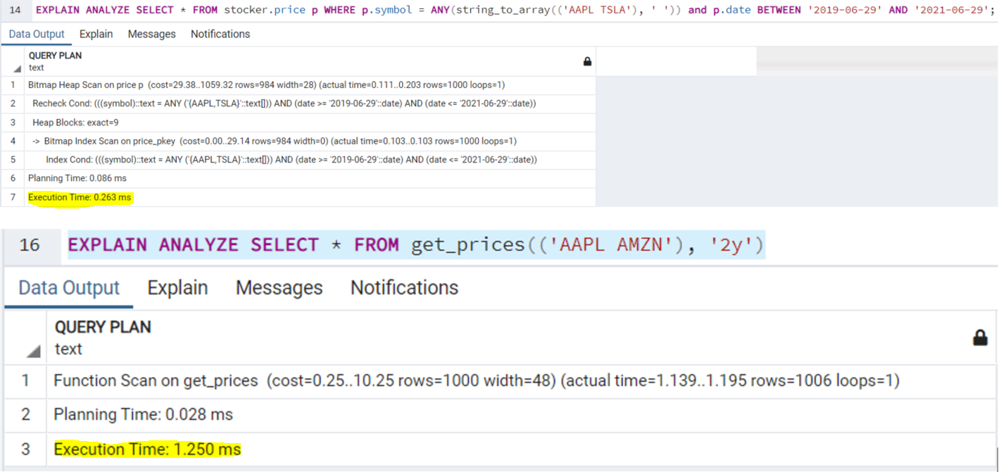
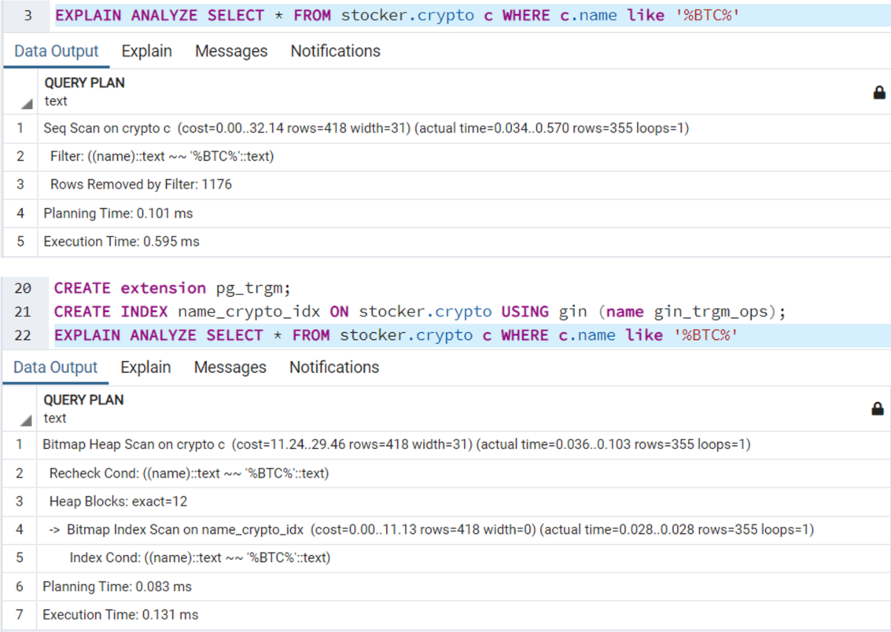

# Stocker

## Definição do modelo e dados da api
Para a elaboração do modelo relacional do banco de dados foi coletada
uma amostra de dados da api, sendo feito o levantamento dos tipos de dados
e também do tamanho máximo dos campos, calculado através de um script, para 
evitar desperdício de memória. A partir disso tivemos os seguintes resultados:

Company

|  Column     |  Type    |  Max Lenght  |
|-------------|----------|--------------|
|  symbol     | VARCHAR  |     5    |
|  name       | VARCHAR  |     37    |
|  exchange   | VARCHAR  |     33    |
|  industry   | VARCHAR  |     119    |
|  website    | VARCHAR  |     33    |
|  description| TEXT     |     1505    |
|  CEO        | VARCHAR  |     23    |
|  sector     | VARCHAR  |     45    |
|  employees  | INT      |     -    |
|  state *    | VARCHAR  |     14    |
|  city  *    | VARCHAR  |     18    |
|  country *  | VARCHAR  |     14    |
|  logo       | VARCHAR  |     67    |

(*) pode ser nulo

News

|  Column     |  Type    |  Max Lenght  |
|-------------|----------|--------------|
|  symbol     | VARCHAR  |     5    |
|  date       | DATE     |     -    |
|  title      | VARCHAR  |     264    |
|  source     | VARCHAR  |     35    |
|  url        | VARCHAR  |     86    |
|  description| TEXT     |     1900    |
|  image      | VARCHAR  |     84    |

Crypto

|  Column     |  Type    |  Max Lenght  |
|-------------|----------|--------------|
|  symbol     | VARCHAR  |     13    |
|  name       | DATE     |     24    |
|  currency   | VARCHAR  |     4    |
|  price      | REAL     |     17    |

**O schema resultante pode ser encontrado no arquivo stocker.sql**

## Segurança

Para demonstração de controle de acesso fizemos a divisão de acesso do sistema
em dois tipos de usuários: admin e advisor. Além disso, temos uma role específica
para a verificação do login no sistema (role: login).

- A role admin possui todos os privilégios do schema
- A role advisor não possui permissão na tabela user, e possui permissão de 
leitura nas demais
- A role login só possui acesso de execução da function login e consequentemente
de leitura da tabela user

O admin pode registrar advisors na tabela user, esses advisors possuiram uma 
senha de acesso que é criptografada com salt antes de ser registrada, utilizando
a extenção pgcrypto. A query para esse procedimento pode ser encontrada em 
utils/db_query.py -> insert_user_query.

## Otimização (Indices)

Além da otimização na construção do schema, foram analizados os tempos de 
execução de algumas queries, buscando possibilidades de melhoria no desempenho. 

**Consulta de preços por período**

O primeiro caso foi a query de preços, como essa query possui como entrada um 
intervalo de duas datas, surgiu a dúvida se o desempenho seria melhor a 
partir do processamento das datas no postgresql ou no python. Assim, 
foi montada a function get_prices (stocker.sql) e comparada com a query 
price_series_query2 (utils/db_query.py)

Como podemos ver pelo resultado, o processamento das datas pelo python trouxe 
um resultado mais satisfatório (0.263 ms / 1.250 ms), se tornando a abordagem 
utilizada.

**Consulta de cryptos por nome**

Para a otimização desse cenário foi pensado a criação de um índice na coluna name 
da tabela crypto, para comprovar a eficácia dessa hipótese as análises foram feitas: 

Na criação do indice também foi utilizada a extensão pg_trgm que torna o processo 
de reconhecimento de cadeia de caracteres mais rápido (https://www.postgresql.org/docs/12/pgtrgm.html), 
a partir dos resultados (0.595 ms / 0.131 ms), o método de indexação com o pg_trgm foi 
utilizado.

**Validação de login**
 
Por fim, foi feita a tentativa de criação de um índice na tabela user sobre as 
colunas user e password com o objetivo da melhorar a validação de usuário. Os 
testes não justificaram a implementação do índice já que os resultados foram muito 
similares e um indexador multiplo com pouca diferença de performance não justificaria 
o uso extra de memória.
