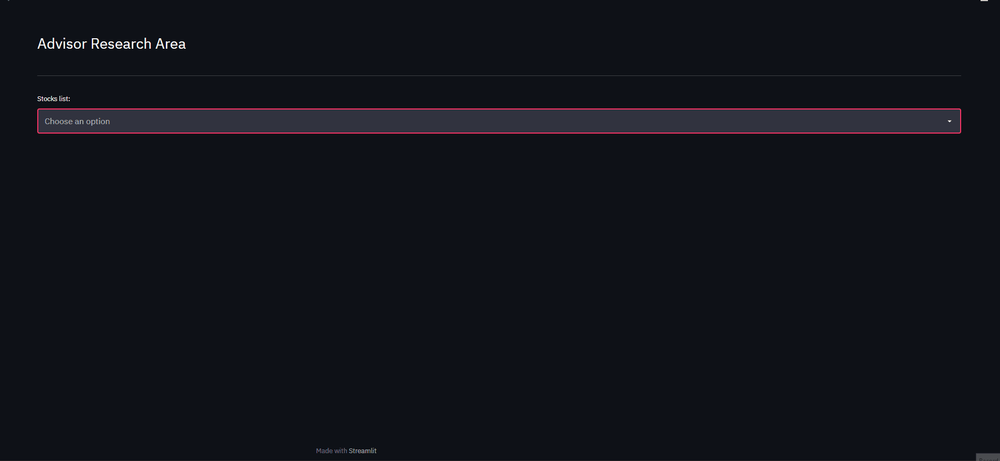

# Stocker

## Sobre

Stocker é uma aplicação de analise de investimento, consumindo dados da API [IEX Cloud](https://iexcloud.io). Desenvolvido na disciplina de Banco de Dados II na [Universidade Federal de Itajubá](https://unifei.edu.br)
 

    

 

## Tecnologias utilizadas

O projeto foi desenvolvido utilizando as seguintes tecnologias:

- [Python](https://www.python.org)
- [PostgreSQL](https://postgresql.org)
- [Streamlit](https://streamlit.io)
- [API IEX Cloud](https://iexcloud.io)

 

## Checklist das etapas do projetos

**Etapa 1 (29/06/2021)**

- [x] Estudar as APIs de dados
- [x] Escolher uma API para utilizar no trabalho

---

**Etapa 2 (29/06/2021)**

- [x] Estudar os dados da API e definir quais serão consumidos
- [x] Gerar um modelo relacional a partir dos dados consumidos
- [x] Implementar o banco de dados relacional

---

**Etapa 3 (29/06/2021)**

- [x] Desenvolver uma aplicação para consumir os dados da API
- [x] Dar carga no banco de dados
- [x] Otimizar o banco de dados

---

**Etapa 4**

- [ ] Estudar sobre Relatórios Ad-Hoc
- [ ] Implementar uma aplicação que gere Relatórios Ad-Hoc dinamicamente para a base de dados analisada

---

**Etapa 5**

- [ ] Avaliar a performance dos bancos relacional utilizando o JMeter

---

**Etapa 6 (26/07/2021)**

- [ ] Apresentar os resultados obtidos nas etapas 3, 4 e 5

---
